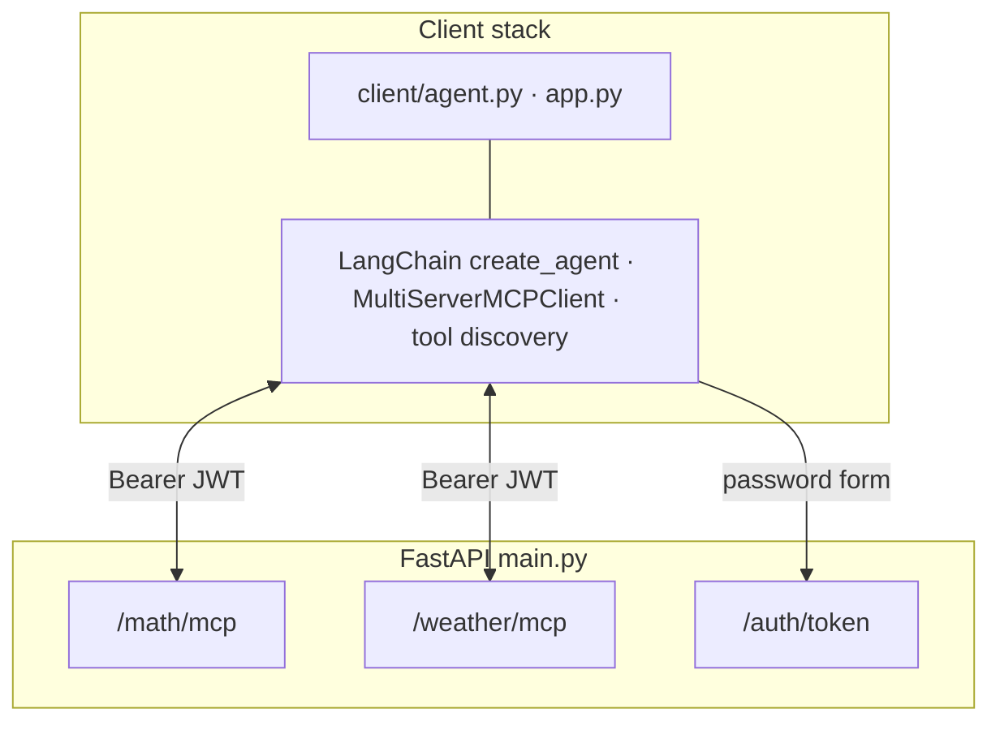

# Custom MCP Server & Client

A demonstration of the Model Context Protocol (MCP) architecture with custom servers and a ReAct agent client. This project showcases how to build modular, tool-based AI systems using MCP.

## What is MCP?

The Model Context Protocol (MCP) is a standard for connecting AI models to external tools and data sources. It enables:

- **Modular Architecture**: Separate tools into independent servers
- **Tool Discovery**: Automatic tool registration and discovery
- **Multiple Transports**: Support for stdio, HTTP, and other communication methods
- **Type Safety**: Strongly typed tool definitions with automatic validation

## Architecture Overview

The client runs a single LangChain agent that discovers tools from **two MCP mounts** (math and weather) on the same FastAPI app over **streamable HTTP**, with JWT Bearer auth on MCP endpoints.



**Flow:** the model decides when to call tools; each call goes over MCP to the mounted server on the API host, and results return through the same path until the agent finishes the reply.

## Project Structure

```
custom-mcp-server/
├── main.py                 # FastAPI app: auth + MCP mounts (run with uvicorn)
├── app.py                  # Streamlit chat UI (optional)
├── client/
│   ├── agent.py            # LangChain agent + token helpers
│   └── config.py           # MCP URLs and MultiServerMCPClient config
├── server/                 # MCP servers, auth, persistence
└── requirements.txt
```

## Key Components

### 1. MCP Servers (FastAPI)

**Math and weather** are defined under [`server/`](server/) and mounted from [`main.py`](main.py) at `/math` and `/weather` with streamable HTTP and scoped JWT access.

### 2. MCP Client

**Agent** ([`client/agent.py`](client/agent.py)): connects to both mounts via `MultiServerMCPClient`, uses LangChain `create_agent` with Groq.

**Streamlit UI** ([`app.py`](app.py)): log in against `POST /auth/token`, then chat with the agent.

## Quick Start

Requires **Python 3.12+**.

1. **Create a virtual environment and install dependencies**:
   ```bash
   python -m venv .venv
   ```

   Activate it, then install packages:

   - **macOS / Linux**:
     ```bash
     source .venv/bin/activate
     pip install -r requirements.txt
     ```
   - **Windows (PowerShell)**:
     ```powershell
     .\.venv\Scripts\Activate.ps1
     pip install -r requirements.txt
     ```

2. **Configure environment**: copy `.env.example` to `.env` and set at least `JWT_SECRET`, `GROQ_API_KEY`, and (for weather) `WEATHER_API_KEY`. See `.env.example` for optional MCP client variables (`MCP_SERVER_URL`, `MCP_BEARER_TOKEN`, etc.).

3. **Run the API** (from repo root):
   ```bash
   python main.py
   ```
   or `uvicorn main:app --host 0.0.0.0 --port 8000`.

4. **Run the client** (choose one):
   - **CLI**: `python -m client.agent "Your question here"` (or omit the argument to be prompted). Uses `.env` token or `MCP_AUTH_*`, else prompts for username and password.
   - **Streamlit**: `streamlit run app.py`.

## MCP Learning Points

### Server Development
- **FastMCP**: Simplifies MCP server creation with decorators
- **Tool Definition**: Use type hints and docstrings for automatic schema generation
- **Transport Selection**: Choose between stdio, HTTP, or other transports based on use case

### Client Development
- **Multi-Server Support**: Connect to multiple MCP servers simultaneously
- **Tool Discovery**: Automatic tool registration from connected servers
- **Agent Integration**: Use with LangGraph, LangChain, or other agent frameworks

### Best Practices
- **Type Safety**: Always use type hints for better tool validation
- **Error Handling**: Implement proper error handling in tools
- **Documentation**: Write clear docstrings for tool descriptions
- **Transport Choice**: Use stdio for local tools, HTTP for distributed systems
