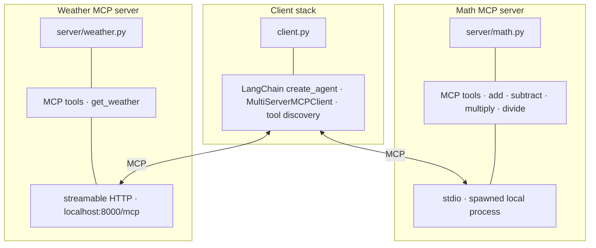

# Custom MCP Server & Client

A demonstration of the Model Context Protocol (MCP) architecture with custom servers and a ReAct agent client. This project showcases how to build modular, tool-based AI systems using MCP.

## What is MCP?

The Model Context Protocol (MCP) is a standard for connecting AI models to external tools and data sources. It enables:

- **Modular Architecture**: Separate tools into independent servers
- **Tool Discovery**: Automatic tool registration and discovery
- **Multiple Transports**: Support for stdio, HTTP, and other communication methods
- **Type Safety**: Strongly typed tool definitions with automatic validation

## Architecture Overview

The client runs a single LangChain agent that discovers tools from **two independent MCP servers** over different transports:



**Flow:** the model decides when to call tools; each call goes over MCP to the right server (math via stdio, weather via HTTP), and results return through the same path until the agent finishes the reply.

## Project Structure

```
custom-mcp-server/
├── client.py              # ReAct agent client
├── server/
│   ├── math.py            # Math MCP server (stdio)
│   └── weather.py         # Weather MCP server (HTTP)
└── requirements.txt       # Dependencies
```

## Key Components

### 1. MCP Servers

**Math MCP server** (`server/math.py`):
- Uses `stdio` transport for direct communication
- Provides basic math operations: add, subtract, multiply, divide
- Demonstrates simple tool definition with FastMCP

**Weather MCP server** (`server/weather.py`):
- Uses `streamable-http` transport for web communication
- Integrates with external weather API
- Shows async tool implementation

### 2. MCP Client

**ReAct Agent** (`client.py`):
- Connects to multiple MCP servers simultaneously
- Uses LangChain's `create_agent` for tool orchestration
- Demonstrates multi-server tool integration

## Quick Start

Requires **Python 3.12+**.

1. **Create a virtual environment and install dependencies**:
   ```bash
   python -m venv .venv
   ```

   Activate it, then install packages:

   - **macOS / Linux**:
     ```bash
     source .venv/bin/activate
     pip install -r requirements.txt
     ```
   - **Windows (PowerShell)**:
     ```powershell
     .\.venv\Scripts\Activate.ps1
     pip install -r requirements.txt
     ```

2. **Set environment variables**:
   - **macOS / Linux**:
     ```bash
     export GROQ_API_KEY="your-groq-api-key"
     export WEATHER_API_KEY="your-weather-api-key"
     ```
   - **Windows (PowerShell)**:
     ```powershell
     $env:GROQ_API_KEY = "your-groq-api-key"
     $env:WEATHER_API_KEY = "your-weather-api-key"
     ```

3. **Run the Weather Server** (in one terminal):
   ```bash
   python server/weather.py
   ```

4. **Run the Client** (in another terminal):
   ```bash
   python client.py
   ```

## MCP Learning Points

### Server Development
- **FastMCP**: Simplifies MCP server creation with decorators
- **Tool Definition**: Use type hints and docstrings for automatic schema generation
- **Transport Selection**: Choose between stdio, HTTP, or other transports based on use case

### Client Development
- **Multi-Server Support**: Connect to multiple MCP servers simultaneously
- **Tool Discovery**: Automatic tool registration from connected servers
- **Agent Integration**: Use with LangGraph, LangChain, or other agent frameworks

### Best Practices
- **Type Safety**: Always use type hints for better tool validation
- **Error Handling**: Implement proper error handling in tools
- **Documentation**: Write clear docstrings for tool descriptions
- **Transport Choice**: Use stdio for local tools, HTTP for distributed systems
