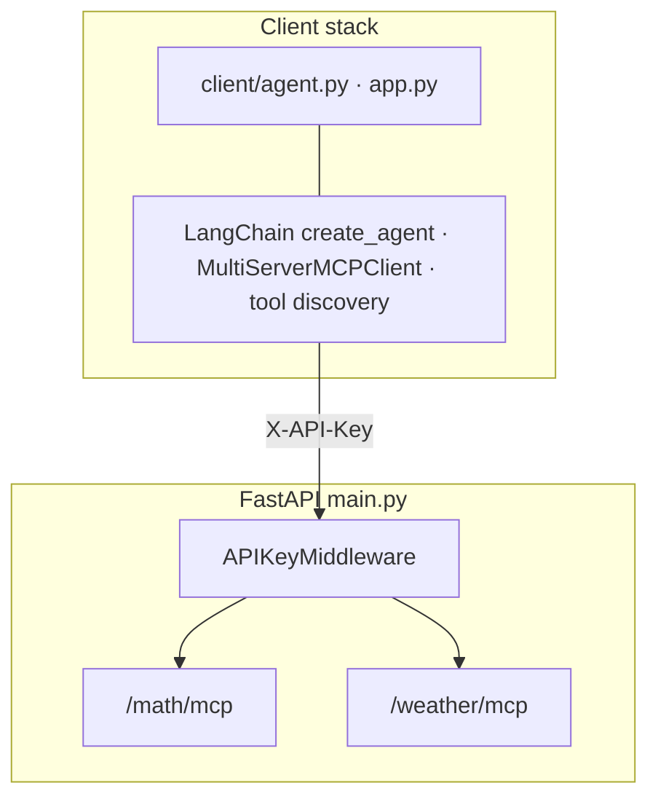

# Custom MCP Server & Client


A demonstration of the Model Context Protocol (MCP) architecture with custom servers and a ReAct agent client. This project showcases how to build modular, tool-based AI systems using MCP.


## What is MCP?


The Model Context Protocol (MCP) is a standard for connecting AI models to external tools and data sources. It enables:


- **Modular Architecture**: Separate tools into independent servers

- **Tool Discovery**: Automatic tool registration and discovery

- **Multiple Transports**: Support for stdio, HTTP, and other communication methods

- **Type Safety**: Strongly typed tool definitions with automatic validation


## Architecture Overview


The client runs a single LangChain agent that discovers tools from **two MCP mounts** (math and weather) on the same FastAPI app over **streamable HTTP**, protected by API-key middleware on each mount.



```mermaid

flowchart TB

    subgraph cli["Client stack"]

        direction TB

        c_title["client/agent.py · app.py"]

        c_detail["LangChain create_agent · MultiServerMCPClient · tool discovery"]

        c_title --- c_detail

    end


    subgraph api["FastAPI main.py"]

        direction TB

        mw["APIKeyMiddleware"]

        math_m["/math/mcp"]

        wx_m["/weather/mcp"]

        mw --> math_m

        mw --> wx_m

    end


    c_detail -->|X-API-Key| mw

```


**Flow:** the model decides when to call tools; each call goes over MCP to the mounted server on the API host, and results return through the same path until the agent finishes the reply.


## Project Structure


```

custom-mcp-server/

├── main.py                 # FastAPI app: API-key middleware + MCP mounts (run with uvicorn)

├── app.py                  # Streamlit chat UI (optional)

├── client/

│   ├── agent.py            # LangChain agent + API key helpers

│   ├── config.py           # MCP URLs and MultiServerMCPClient config

│   └── mcp_discovery.py    # Tools/resources/prompts listing for Connection tab

├── server/                 # MCP servers and middleware

└── requirements.txt

```


## Key Components


### 1. MCP Servers (FastAPI)


**Math and weather** are defined under [`server/`](server/) and mounted from [`main.py`](main.py) at `/math` and `/weather` with streamable HTTP. Clients connect at `/math/mcp` and `/weather/mcp`. `APIKeyMiddleware` guards each mount prefix; requests must include `X-API-Key` matching server `MCP_API_KEY`.


### 2. MCP Client


**Agent** ([`client/agent.py`](client/agent.py)): connects to both mounts via `MultiServerMCPClient`, uses LangChain `create_agent` with Groq.


**Streamlit UI** ([`app.py`](app.py)): two tabs — **Connection** (full MCP server URL + API key, discovery) then **Chat** (agent scoped to that server).


## Quick Start


Requires **Python 3.12+**.


1. **Create a virtual environment and install dependencies**:

   ```bash

   python -m venv .venv

   ```


   Activate it, then install packages:


   - **macOS / Linux**:

     ```bash

     source .venv/bin/activate

     pip install -r requirements.txt

     ```

   - **Windows (PowerShell)**:

     ```powershell

     .\.venv\Scripts\Activate.ps1

     pip install -r requirements.txt

     ```


2. **Configure environment**: copy `.env.example` to `.env`. Set `MCP_API_KEY` (the example includes a dev placeholder; generate your own with `python -c "import secrets; print(secrets.token_urlsafe(32))"`). Also set `GROQ_API_KEY` for the client and `WEATHER_API_KEY` on the server if you use weather tools.


3. **Run the API** (from repo root):

   ```bash

   python main.py

   ```

   or `uvicorn main:app --host 0.0.0.0 --port 8000`.


4. **Run the client** (choose one):

   - **CLI**: `python -m client.agent "Your question here"` — uses `MCP_API_KEY` from `.env`, or `--api-key`, or prompts with `getpass`.

   - **Streamlit**: `streamlit run app.py`
     1. Open the **Connection** tab. Enter the full MCP URL (e.g. `http://127.0.0.1:8000/math/mcp` or `.../weather/mcp`) and API key, then click **Connect**.
     2. After connect, the UI shows that server's **tools**, **resources**, and **prompts**.
     3. Switch to **Chat** — the agent only has access to the connected MCP server. Use **Disconnect** to clear the session.

     Server and client must share the same `MCP_API_KEY`; the API must have `MCP_API_KEY` configured.


## MCP Learning Points


### Server Development

- **FastMCP**: Simplifies MCP server creation with decorators

- **Tool Definition**: Use type hints and docstrings for automatic schema generation

- **Transport Selection**: Choose between stdio, HTTP, or other transports based on use case


### Client Development

- **Multi-Server Support**: Connect to multiple MCP servers simultaneously

- **Tool Discovery**: Automatic tool registration from connected servers

- **Agent Integration**: Use with LangGraph, LangChain, or other agent frameworks


### Best Practices

- **Type Safety**: Always use type hints for better tool validation

- **Error Handling**: Implement proper error handling in tools

- **Documentation**: Write clear docstrings for tool descriptions

- **Transport Choice**: Use stdio for local tools, HTTP for distributed systems

